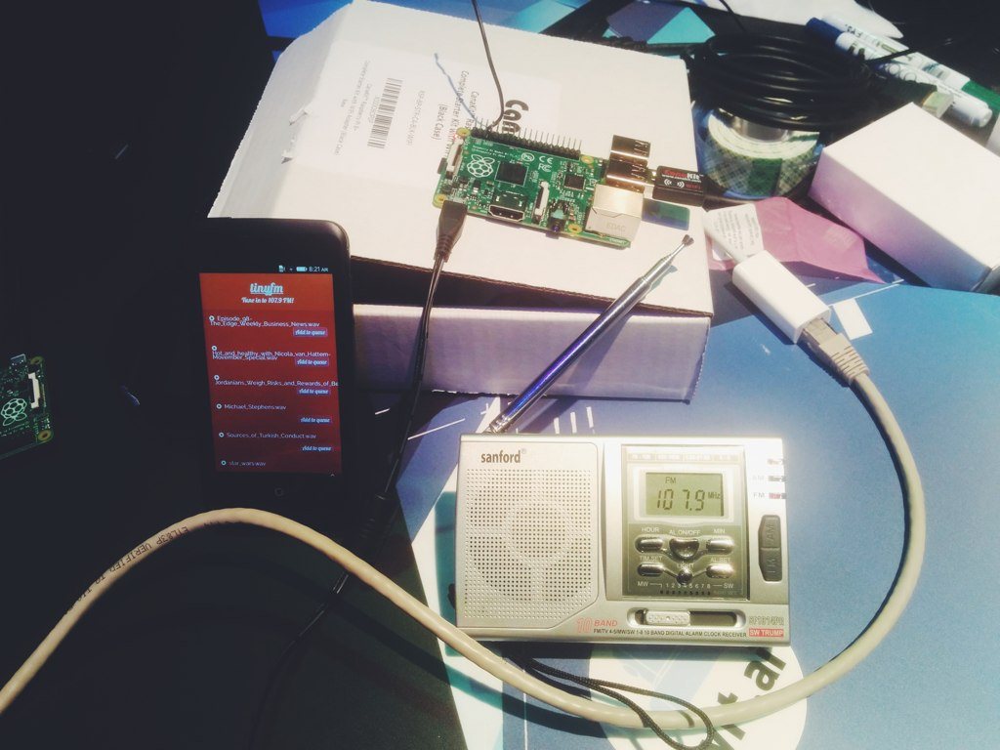

# tinyfm

> tinyfm sandbox image for development purpose.



Because developing straight on a RaspberryPi is long and tedious, this Vagrant image helps to replicate a similar environment to the *tinyfm board*.

It setups:

- a [Mopidy server](https://www.mopidy.com/) to manage a media playlist of digital assets to broadcast over FM;
- the [tinyfm Client-app](https://github.com/tinyfm/Client-app) to   request media assets to be broadcasted;
- the [mpd2fm bridge](https://github.com/tinyfm/mpd2fm) which broadcasts playback to FM waves.

This project has been initiated as part of [Al Jazeera Canvas hackaton](http://canvas.aljazeera.com) in November 2014.

# Install

The install procedures downloads a fair amount of useful packages, configuration files and services.
It should take a **couple of minutes** to be ready.

## Vagrant sandbox

Requires *Vagrant* and *VirtualBox*.

```bash
git clone https://github.com/tinyfm/sandbox.git tinyfm-sandbox
cd tinyfm-sandbox && vagrant up
```

## On a Raspberry Pi

```bash
wget -q -O - https://raw.githubusercontent.com/tinyfm/sandbox/master/install.sh | bash -
```

# Usage

An Web server should be running on [localhost:6680](http://localhost:6680).

The content of the tracklist can be displayed with a small Node script:

```bash
npm install

HOST=localhost node src/display-tracks.js
```

# Raspberry Pi

When `install.sh` is run on a Raspberry Pi, it should make it visible through the ZeroConf/Bonjour/mDNS protocol.

```bash
ssh pi@raspberrypi.local
```